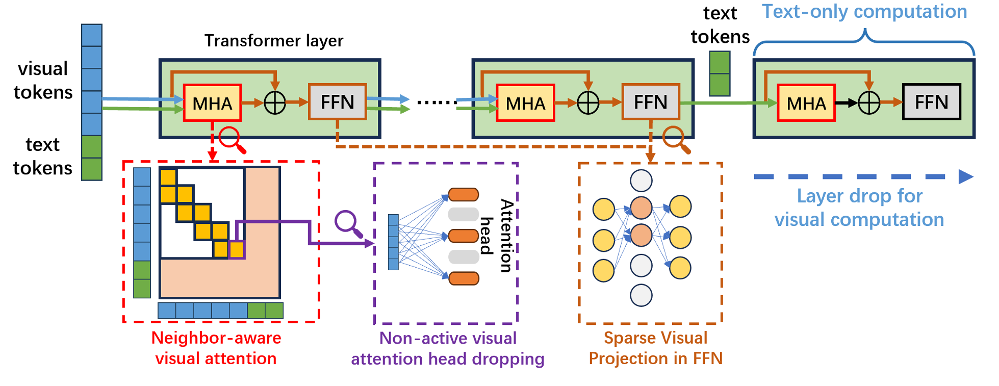

# :rocket: YOPO: You Only Prune Once for Your MLLMs


Official code for our paper: [Treat Visual Tokens as Text? But Your MLLM Only Needs Fewer Efforts to See](https://arxiv.org/abs/2410.06169)



:bangbang: While many studies focus on pruning visual tokens to reduce the computational overhead caused by visual redundancy, the process of identifying these tokens for each conversation is itself resource-intensive. Now the question comes, 

**Can we prune our MLLM just once instead?**

## Core pruning strategies

Compared with text information, visual information is much more sparse, making it not necessary to use all parameters of MLLM for visual-related computation.

***Neighbor-aware visual attention computation:*** Only spatial neighbor visual tokens are involved in the computation.      
***Non-active visual attention dropping:*** The attention weight ratio between the visual and text tokens can be used to evaluate the importance of attention heads in visual computation, thus helping to prune lazy neurons.     
***Sparse visual projection:*** Benefiting from the sparse visual representation, most neurons can be dropped in FFN visual computation.    
***Layer drop for visual computation:*** Stopping the visual-related computation for the last several layers.  

Please refer to our paper for more details.


## ToDO list
:white_check_mark: pruning code for LLaVA   
:white_check_mark: checkpoints of pruned LLaVA     
:white_check_mark:  pruning code for Qwen2-VL  
:white_check_mark:  pruning code for InternVL     


The currently released pruning code is used for simulation through the masking operation. The code integrating the proposed strategies into the KV-cache computation will be released soon.


## Install
1.  Set up LLavA  https://github.com/haotian-liu/LLaVA 
```Shell
cd LLaVA
conda create -n llava python=3.10 -y
conda activate llava
pip install --upgrade pip  
pip install -e .
pip install -e ".[train]"
pip install flash-attn --no-build-isolation   
pip install transformers==4.36.2
```   
Besure to check the last step to degrade the version of transformers, otherwise there will be some issue during the inference.   


2. Copy our updated `modeling_llama.py` to transformer library
```Shell
cp ../modeling_llama_prune.py {YOUR ENV PATH}/lib/python3.10/site-packages/transformers//models/llama/modeling_llama.py
# eg. cp ../modeling_llama_prune.py /opt/conda/envs/llava/lib/python3.10/site-packages/transformers//models/llama/modeling_llama.py

```


## Inference
1. Download the checkpoints of pruned LLaVA
   
   [LLaVA-1.5-7B (12% FLOPs)](https://huggingface.co/zwt123home123/llava-1.5-7b-prune-zp12)

   [LLaVA-1.5-7B (25% FLOPs)](https://huggingface.co/zwt123home123/llava-1.5-13b-prune-zp25)

   [LLaVA-1.5-13B (12% FLOPs)](https://huggingface.co/zwt123home123/llava-1.5-7b-prune-zp12)

   [LLaVA-1.5-13B (25% FLOPs)](https://huggingface.co/zwt123home123/llava-1.5-13b-prune-zp25)

2. Run inference
```Shell
bash LLavA/infer.sh
```
:triangular_flag_on_post:  We will release the code for pruning the visual computation in Qwen, InternVL without the fine-tuning process very soon.  
 
## Training

1. Download and set up LLaVA-1.5 2nd stage training data
   https://github.com/haotian-liu/LLaVA/blob/main/docs/Data.md
2. Download LLaVA-1.5 mm_projector weights
   
   https://huggingface.co/liuhaotian/llava-v1.5-mlp2x-336px-pretrain-vicuna-13b-v1.5

   https://huggingface.co/liuhaotian/llava-v1.5-mlp2x-336px-pretrain-vicuna-7b-v1.5

   put them into `./checkpoints/llava-v1.5-13b-pretrain` and `./checkpoints/llava-v1.5-7b-pretrain` respectively
4. Run training
```Shell
bash scripts/v1_5/finetune_yopo.sh
```
## Evaluation

- We evaluated our model on multiple visual question-answering and reasoning benchmarks, including VQAv2, GQA, ScienceQA, TextVQA, POPE, MME, and MMBench.  
- For evaluation, you can use either **LLaVA eval** or **lmms-eval**:  
  - **LLaVA eval**: Detailed setup instructions can be found [here](https://github.com/haotian-liu/LLaVA/blob/main/docs/Evaluation.md).  
  - **lmms-eval**: Detailed setup instructions can be found [here](https://github.com/EvolvingLMMs-Lab/lmms-eval).  


## For InternVL2-4B/8B/26B inference pruning without fine-tuning   
1. please follow the instructions in InternVL-2 to install the InternVL: https://internvl.github.io/blog/2024-07-02-InternVL-2.0/   


2. For convenience, we provide the pruning models here (note that these models have the same weights with the original one, we include the inference code with pruning stratgies in corresponding repo.)   
https://huggingface.co/zwt123home123/InternVL2-4B-YOPO   
https://huggingface.co/zwt123home123/InternVL2-8B-YOPO   
https://huggingface.co/zwt123home123/InternVL2-26B-YOPO

***What we change in the inference code?***   
https://huggingface.co/zwt123home123/InternVL2-26B-YOPO/blob/main/modeling_internlm2.py#L311-L317   
https://huggingface.co/zwt123home123/InternVL2-26B-YOPO/blob/main/modeling_internlm2.py#L446-L470   


3. For evaluation,
```Shell
model = AutoModel.from_pretrained(
    path,
    torch_dtype=torch.bfloat16,
    low_cpu_mem_usage=True,
    use_flash_attn=False,
    trust_remote_code=True).eval().cuda()
```


## For Qwen2-vl-8B  inference pruning without fine-tuning   
1. please follow the instructions in Qwen2-vl-8B to install the InternVL: https://huggingface.co/Qwen/Qwen2-VL-7B-Instruct   

2. Copy our updated `modeling_qwen2_vl.py` to transformer library
```Shell 
cp modeling_qwen2_vl.py {YOUR ENV PATH}/lib/python3.10/site-packages/transformers/models/qwen2_vl/modeling_qwen2_vl.py
```


## The computation of headmask

We provide the code to compute the headmask for pruning non-activate visual attention heads in `gen_mask_llava.py` and `gen_mask_internvl_qwen.py`.   

The headmask for different models can be found in https://drive.google.com/drive/folders/17xPC4pPTs-7WQDoRvjVu1ZYRa7y7GAZE?usp=sharing  

You can generate the headmask for your own model based on your own calibration dataset refering to the code here: https://huggingface.co/zwt123home123/InternVL2-8B-YOPO/blob/main/modeling_internlm2.py#L462-L471


## License

This project is released under the [MIT license](LICENSE). Parts of this project contain code and models from other sources, which are subject to their respective licenses.

## Citation

If you find the idea or code useful for your research, please consider citing our [paper](https://arxiv.org/abs/2403.12777):

```
@article{zhang2024treat,
  title={Treat Visual Tokens as Text? But Your MLLM Only Needs Fewer Efforts to See},
  author={Zhang, Zeliang and Pham, Phu and Zhao, Wentian and Wan, Kun and Li, Yu-Jhe and Zhou, Jianing and Miranda, Daniel and Kale, Ajinkya and Xu, Chenliang},
  journal={arXiv preprint arXiv:2410.06169},
  year={2024}
}
```

## Contact
Questions and suggestions can be sent to hust0426@gmail.com and {wezhao, kuwan}@adobe.com.
